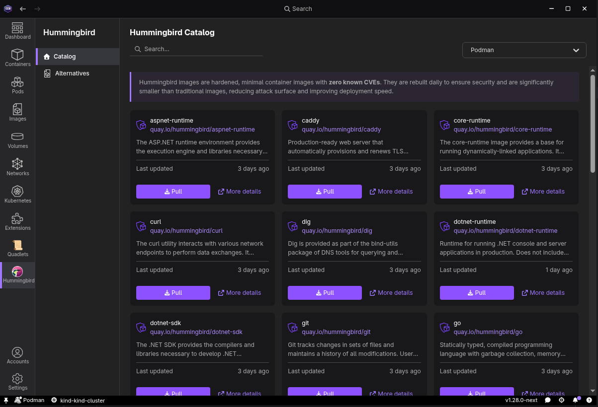
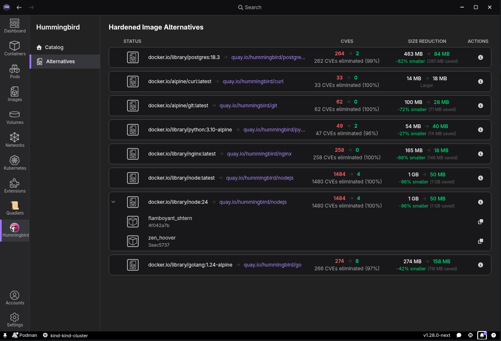
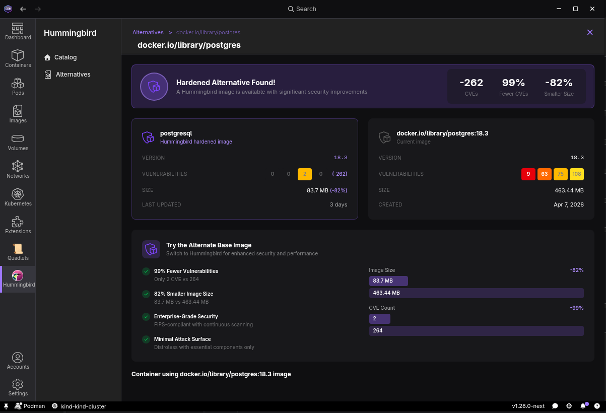
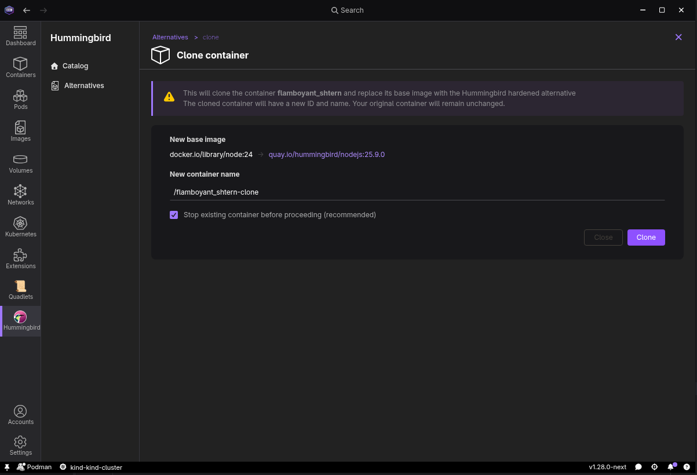

# Hummingbird Extension for Podman Desktop

This extension integrates the [Hummingbird project](https://hummingbird-project.io/) hardened images to Podman Desktop.

## Features

### Hummingbird Catalog

The Podman Desktop Hummingbird extension allows you to directly list the Hummingbird hardened images
from withing Podman Desktop and pull them.

### Alternative page

As the extension is integrated in Podman Desktop, it can scan your local registry and directly suggest alternative
images. 

Combined with the [Grype](https://github.com/podman-desktop/extension-grype) extension, you will be able to compare the
image and their alternatives, comparing image size and number of CVEs.

You can get detailed insight on the alternative and the base image in the dedicated details page

### Cloning

Listing image is great, but we also detect the containers that are using an image with a hardened alternative.
From the Hummingbird extension, you can take an existing container and clone its config to use with a Hummingbird image.

